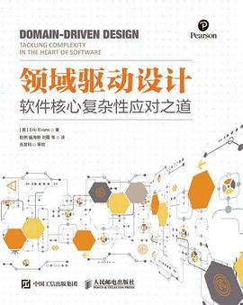
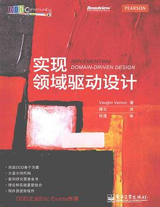
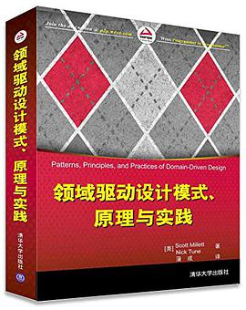
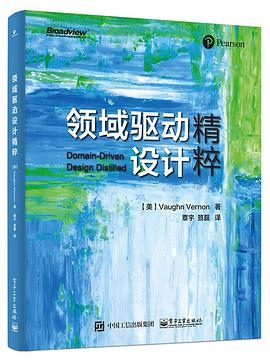
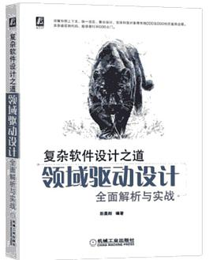
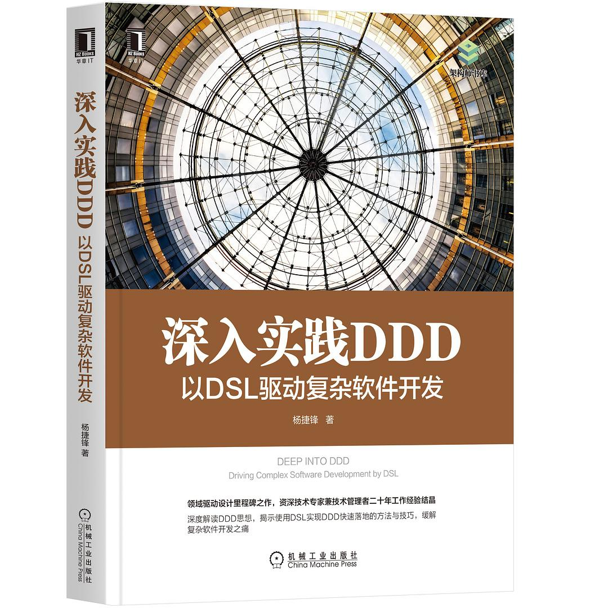
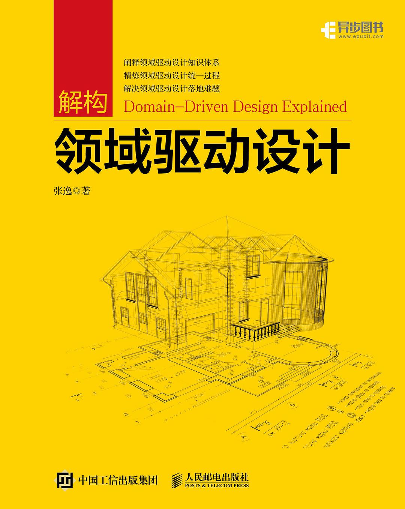

# 领域驱动设计中文资料（持续更新中）
## 图书

| 书名|封面|作者  |出版时间  | 介绍 |
| --- | --- | --- | ---  | --- |
| [领域驱动设计](https://union-click.jd.com/jdc?e=&p=JF8BAOkJK1olXDYCV1dbCUoQB19MRANLAjZbERscSkAJHTdNTwcKARlZAUEPVhcJRT9LT0VSBVJESw4PTRNJXGFOSxhBJVMOVF1UDkoWBGs4ezhOKEFBHDU-QB9DWREWTTldPwd6ElJROE4XAm4MElwcXwMyV19eC00SAm4AHGslXQUyAjBdCUoWAm4NH1wSbQQDVVtcDEkVBm04G1wXVAYDXF9bDEkeB18PG1IlhZS9gdbn3MWB2vmnK2slXjYyZF5tC3tVbThaSFMTWAAFA10KCE4WA2hYHVlHClEEXQ5VCxgRVG9dK1kUXAILZA)||“领域驱动设计之父”Eric Evans的开山之作  |2003-8-30 |03年的著作，距今有些年头了，新手不建议直接阅读，有一定的经验积累后再读  |
| [实现领域驱动设计](https://union-click.jd.com/jdc?e=&p=JF8BAOkJK1olXDYCVFteCkgTBF9MRANLAjZbERscSkAJHTdNTwcKARlZAUEPVhcJRT9LT0VSBVJESw4PTRNJXGFOSxhBJVMOVF5YC0kUB2g4czBTHH1jPD8-cxdlAglJTy8RFV1kJFJROE4XAm4MElwcXwMyV19eC00SAm4AHGslXQUyAjBdCUoWAm4NG14WbQQDVVtcDEkVBm04G1wXVAYDXF9YD0sTAF8PG1IlhZS9gdbn3MWB2vmnK2slXjYyZF5tC3tVbWsPHVIXDgNXXA0NW04fAWgBHF9FXAMABApZWkkSUzsAK1kUXAILZA) ||软件工匠Vaughn Vernon之作，翻译腾云和审校张逸都是领域驱动设计布道的先驱 |2013-2-16| 分别从战略和战术层面详尽地讨论了如何实现DDD，内容详尽，脉络清晰，可作为领域驱动实践者的指导书|
|[领域驱动设计模式、原理与实践](https://union-click.jd.com/jdc?e=&p=JF8BAOkJK1olXDYCVFdVCEsXBF9MRANLAjZbERscSkAJHTdNTwcKARlZAUEPVhcJRT9LT0VSBVJESw4PTRNJXGFOSxhBJVMOVF5UAEsXA2g4RQcLDWdEUAg-CQNOZBJybBBSXV1FAlJROE4XAm4MElwcXwMyV19eC00SAm4AHGslXQUyAjBdCUoWAm4NG1sVbQQDVVtcDEkVBm04G1wXVAYDXF9cCUMVA18PG1IlhZS9gdbn3MWB2vmnK2slXjYyZF5tC3tVbTwIG11GCAACUlZUC04fUDxbGl1BXAJQVV9YDUpECmoLK1kUXAILZA) || Scott Millett和Nick Tune著作  |2015-5-4 | 深入浅出领域驱动战略设计和战术落地，适合新手入门以及系统性学习|
| [领域驱动设计精粹](https://union-click.jd.com/jdc?e=&p=JF8BAOkJK1olXDYCV1tYDkoeAF9MRANLAjZbERscSkAJHTdNTwcKARlZAUEPVhcJRT9LT0VSBVJESw4PTRNJXGFOSxhBJVMOVF1YDU0WCmw4fyNVJlxcPD04cxtsQDkBSUEXR2FiNFJROE4XAm4MElwcXwMyV19eC00SAm4AHGslXQUyAjBdCUoWAm4NG14WbQQDVVtcDEkVBm04G1wXVAYDXF5cAUoSB18PG1IlhZS9gdbn3MWB2vmnK2slXjYyZF5tC3tVbW9fS1odCFUDVA4KC04VVG4BT14WVQdSAVhfDUlAC2ZaK1kUXAILZA) || 软件工匠Vaughn Vernon之作  |2016-6-2 | 本书以一个案例贯穿全书，不断引入领域驱动设计的各个概念，适合新手入门|
|[领域驱动设计全面解析与实战](https://union-click.jd.com/jdc?e=&p=JF8BAOkJK1olXDYCV1ZZAU8TCl9MRANLAjZbERscSkAJHTdNTwcKARlZAUEPVhcJRT9LT0VSBVJESw4PTRNJXGFOSxhBJVMOVF1VDEITB2Y4YghCJU4AUjY9AC1IWD9fbS1lABwKNFJROE4XAm4MElwcXwMyV19eC00SAm4AHGslXQUyAjBdCUoWAm4NGl8WbQQDVVtcDEkVBm04G1wXVAYDXVdUDkwTAV8PG1IlhZS9gdbn3MWB2vmnK2slXjYyZF5tC3tVbTtbGF9HVQYGVlcKX05DB24AEwhCXAMHUgtbWhhCV2kNK1kUXAILZA) || 解道（Jdon）的创办者彭晨阳之作 |2020-8-1 | 全书以JiveJdon网站设计为案例，全面解析DDD的分析方法和技术架构，建议在DDD实践中作为参考|
|[深入实践DDD：以DSL驱动复杂软件开发](https://union-click.jd.com/jdc?e=&p=JF8BAOkJK1olXDYCV1dfDUoXBV9MRANLAjZbERscSkAJHTdNTwcKARlZAUEPVhcJRT9LT0VSBVJESw4PTRNJXGFOSxhBJVMOVF1UCk4WA2k4HwBcO1tBAx09Th98YSpAeAdFAEcDNFJROE4XAm4MElwcXwMyV19eC00SAm4AHGslXQUyAjBdCUoWAm4NGl8WbQQDVVtcDEkVBm04G1wXVAYDXVdZDEwVBl8PG1IlhZS9gdbn3MWB2vmnK2slXjYyZF5tC3tVbT9bEgtGWA8DAw0NDk4TB2kASF0WCAdWU11VCUoQBm8NK1kUXAILZA) || 杨捷峰，资深技术专家兼技术管理者 |2020-8-1 | 揭示使用 DSL实现DDD快速落地的方法与技巧，缓解复杂软件开发之痛，建议在DDD实践中作为参考|
| [解构领域驱动设计](https://union-click.jd.com/jdc?e=&p=JF8BAOkJK1olXDYCVlxbAU0QAl9MRANLAjZbERscSkAJHTdNTwcKARlZAUEPVhcJRT9LT0VSBVJESw4PTRNJXGFOSxhBJVMOVFxfDkIRBG44Ug9UK3JGDjc_XUxlVjNxSA5VA1oDNFJROE4XAm4MElwcXwMyV19eC00SAm4AHGslXQUyAjBdCUoWAm4NH1wSbQQDVVtcDEkVBm04G1wXVAYDXVhdCkwTCl8PG1IlhZS9gdbn3MWB2vmnK2slXjYyZF5tC3tVbT9aGV9GVQMAVl5YAE5FAj1bEl0dClMFVQ4JXU8SBzsPK1kUXAILZA) ||张逸，DDD布道者|2021-8-20| 张逸是业界公认的DDD领域专家和布道者，该书沉淀了作者丰富的经验积累，同时对DDD有开创性的突破，建议结合实现领域驱动设计阅读|

## 专栏
| 名称|讲师|简介|
| --- | --- | --- | 
|[手把手教你落地 DDD](http://gk.link/a/12d3z)|钟敬  Thoughtworks 首席咨询师  | 专栏共41讲，基本打通了DDD的最小闭环，尤其建模部分特别精彩|
|[DDD 实战课](http://gk.link/a/10LKM) |欧创新|专栏共21讲，分为基础篇、进阶篇和实战篇三部分。适合初学者入门 |
|[如何落地业务建模](http://gk.link/a/10LKf)|徐昊 ThoughtWorks中国区CTO| 课程包含前云时代的领域驱动设计和云时代的业务建模，专栏质量很高，涉及大量业务建模方法及最佳实践，推荐有一定经验的开发者阅读|

## 博客
| 名称 |简介 |
| --- | --- | 
|[产品代码都给你看了，可别再说不会DDD](https://www.cnblogs.com/davenkin/p/ddd-introduction.html)|实现领域驱动设计译者——腾云写的，落地性强|
|[阿里技术专家详解 DDD系列](https://blog.csdn.net/Taobaojishu/article/details/100425428)|博客质量很高，落地性强|
|[汤雪华的博客](https://www.cnblogs.com/netfocus/category/361987.html)|主要专注的领域是DDD/CQRS，博客有很多自己的思考|
|[从壹开始微服务 [ DDD ] 之一](https://www.cnblogs.com/laozhang-is-phi/p/9806335.html) |从0开始DDD实践，很接地气|
|[彭晨阳的博客](https://www.jdon.com/ddd.html)|偏向于架构设计理论与入门基础|
|[ThoughtWorks中国](https://zhuanlan.zhihu.com/c_137428247)|TW咨询师出品，篇篇好文|

## 公众号

| 名称 |简介 |
| --- | --- | 
| 从码农到工匠 | COLA作者张建飞的个人公众号|
| DDD领域驱动设计峰会 | DDDChina由国内DDD思想和实践社区发起，同步最新峰会进展|
| DDD和微服务 | TW总监咨询师林宁的个人公众号|
| 码农戏码 | 架构师朱先生的个人公众号|
| 枪炮与代码 | TW总监咨询师胡皓的个人公众号|
| 逸言 | 《解构领域驱动设计》作者张逸的个人公众号|

## 视频
- [2017年领域驱动设计峰会](https://www.itdks.com/Home/Act/apply?id=1790)
- [2018年领域驱动设计峰会](https://www.itdks.com/Home/Act/apply?id=2638)
- [2019年领域驱动设计峰会](https://www.itdks.com/Home/Act/apply?id=3188)
- [2020年领域驱动设计峰会](https://app.ma.scrmtech.com/meetings-api/sapIndex/SapSourceData?pf_uid=7019_1254&sid=26124&source=2&pf_type=3&channel_id=838&channel_name=fuwuhao&tag_id=478868299c60f4d9)
- 2021年领域驱动设计峰会
- [面向领域的场景驱动设计](https://developer.aliyun.com/topic/2020/1?s=%E6%9E%B6%E6%9E%84%E8%AE%BE%E8%AE%A1%E4%B8%8E%E4%BB%A3%E7%A0%81%E6%99%BA%E8%83%BD%E4%B8%93%E5%9C%BA&v=43237)

## 框架
- [阿里开源 COLA](https://github.com/alibaba/COLA) - COLA 是 Clean Object-Oriented and Layered Architecture的缩写，代表“整洁面向对象分层架构”。相关书籍，[代码精进之路 从码农到工匠](https://union-click.jd.com/jdc?e=&p=JF8BAOkJK1olXDYCV1ldC04XBV9MRANLAjZbERscSkAJHTdNTwcKARlZAUEPVhcJRT9LT0VSBVJESw4PTRNJXGFOSxhBJVMOVF1aCEgSA2k4HDMUBn9GPQI-WgMTYTNMZgRtInhjAlJROE4XAm4MElwcXwMyV19eC00SAm4AHGslXQUyAjBdCUoWAm4NH1wSbQQDVVtcDEkVBm04G1wXVAYDXFxaCUgRAl8PG1IlhZS9gdbn3MWB2vmnK2slXjYyZF5tC3tVbTgMGAkVXgQKXVtdWk5HVm1bHQ5BCAZRUV8NDRsWAm1bK1kUXAILZA)
- [京东物流开源 dddplus](https://github.com/dddplus/dddplus) - 轻量级业务中台开发框架，侧重点在逆向建模，即通过代码生成可视化模型
- [张逸 diamond](https://github.com/agiledon/diamond) - DDD菱形对称架构
- [张逸 eas-ddd](https://github.com/agiledon/eas-ddd) - EAS系统DDD实战案例
- [梅雪松 aggregate-persistence](https://github.com/meixuesong/aggregate-persistence) - DDD轻量级聚合持久化方案
- [ddd lite](https://github.com/domain-driven-design/ddd-lite-example) - 轻量级DDD分层架构
  

